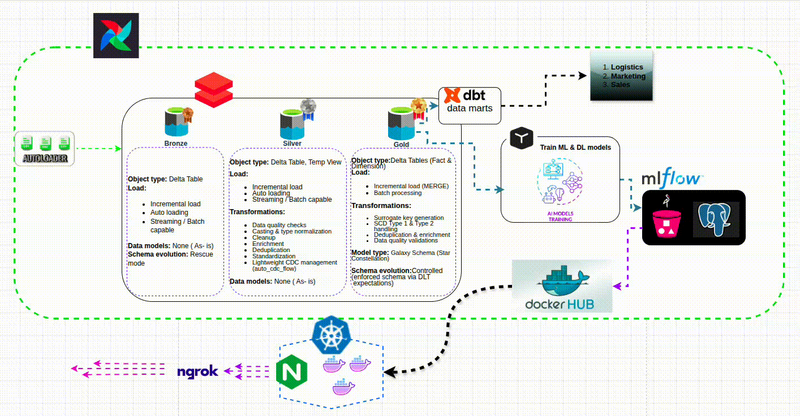
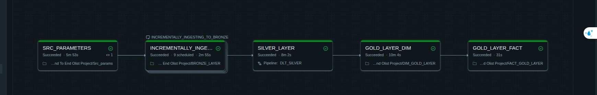
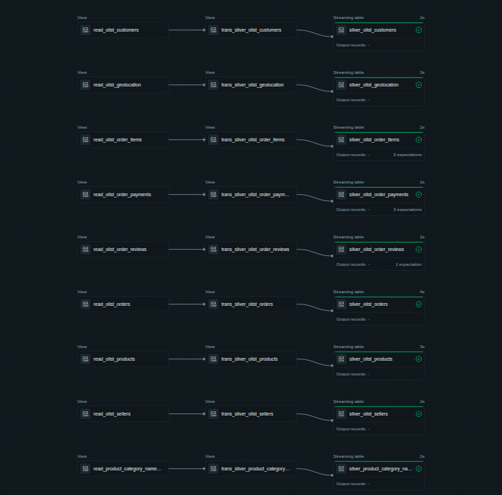
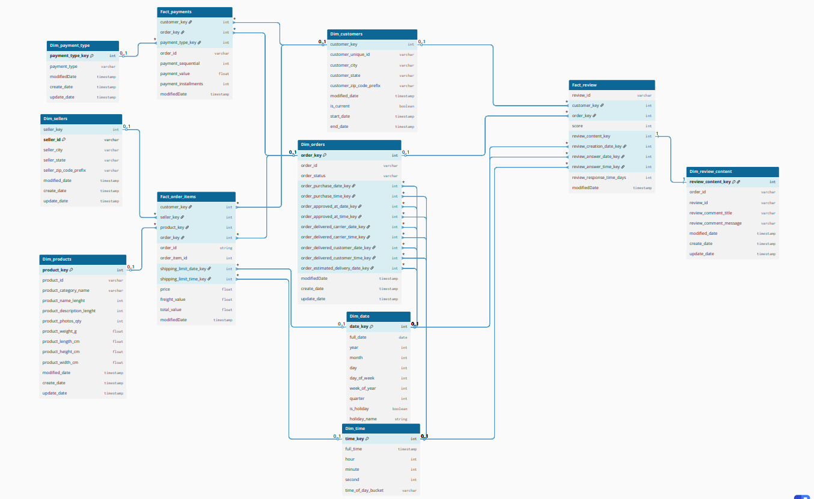
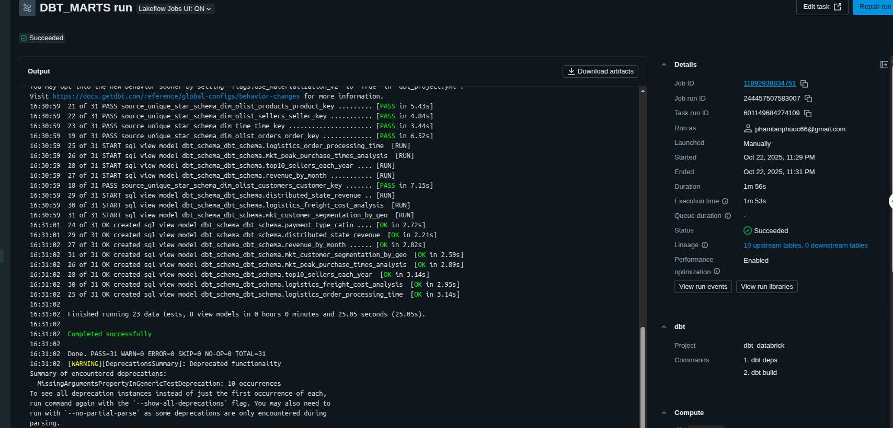
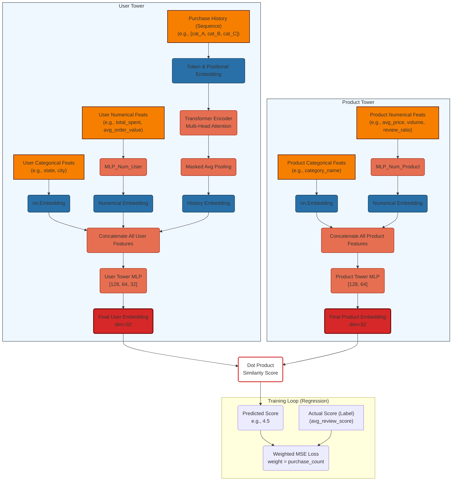
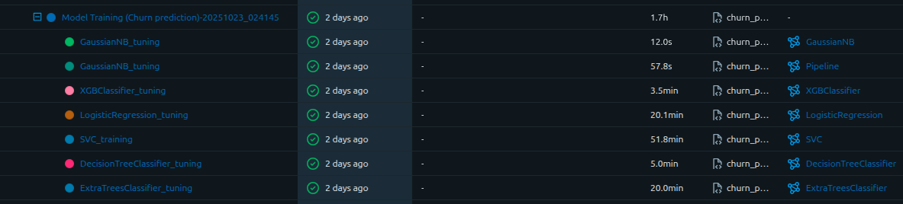
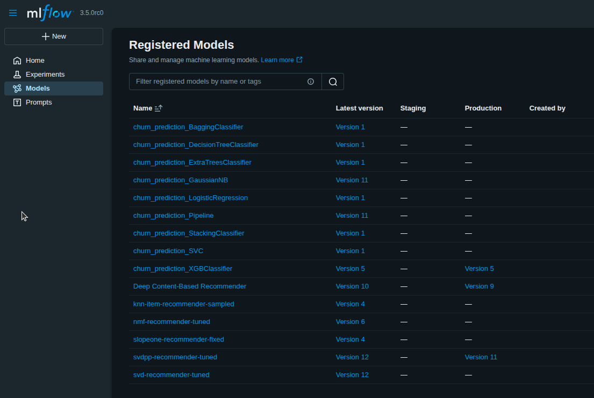
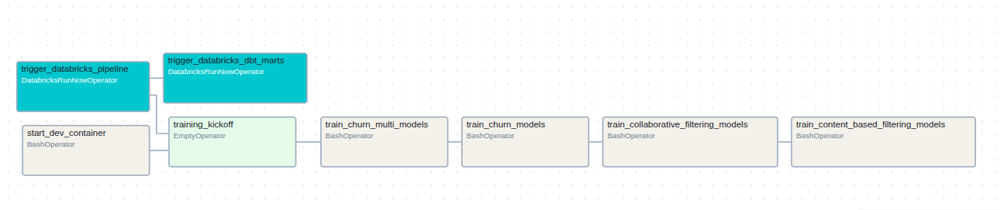
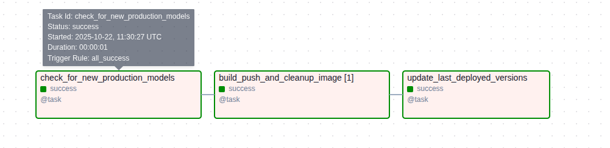

# 🚀 End-to-End Machine Learning & Deep Learning Data Pipeline

## 📋 Project Overview

A comprehensive, production-ready data engineering and machine learning pipeline that demonstrates enterprise-level architecture for data processing, model training, and deployment. This project showcases modern cloud-native technologies, data warehousing best practices, and MLOps workflows.

---

## 🏗️ System Architecture



*Complete end-to-end pipeline orchestration showing data flow from ingestion to model serving*

---

## 📚 Architecture Components

### **1. Data Lakehouse Layer** 🏢

**Platform:** Databricks Cloud (Community Edition)

#### **Medallion Architecture**

Bronze Layer (Raw Data) → Silver Layer (Cleaned & Validated) → Gold Layer (Business Logic) → Data Marts

#### **Key Technologies:**
- **Autoloader:** Automated data discovery and ingestion from cloud storage
- **Streaming Pipelines:** Real-time data processing with Databricks Structured Streaming
- **Incremental Loading:** Optimized data ingestion to minimize storage and compute costs
- **PySpark:** Distributed data processing for large-scale transformations and complex business logic

#### **Databricks Pipeline Visualization**



*Complete Databricks data pipeline showing Bronze → Silver → Gold layers*



*Delta Live Tables (DLT) Silver layer transformation pipeline*

#### **Data Modeling Strategy**

- **Bronze Layer:** Raw data ingestion
- **Silver Layer:** Normalized data with SCD Type 1 (Most dimensions)
- **Gold Layer:** Star Schema with SCD Type 1 (Most) and SCD Type 2 (Customer dimension)

**SCD Type 2 Implementation (Customer Dimension):**
- Maintains complete historical records with effective dates
- Enables temporal analysis and customer journey tracking
- Tracks changes: `start_date`, `end_date`, `is_current` flags



*Complete data warehouse schema with star schema design and dimension tables*

---

### **2. Data Transformation & Marts** 📊

**Tool:** dbt (Data Build Tool)

#### **Architecture:**
- **Version Control:** GitHub-connected dbt project
- **CI/CD Integration:** Automated dbt runs via Airflow
- **Deployment:** Seamless integration with Databricks workspace

#### **Data Marts:**
- **Sales Mart:** Revenue analysis, order metrics, product performance
- **Customer Mart:** Customer segmentation, lifetime value, churn indicators
- **Inventory Mart:** Stock levels, product availability, reorder points
- **Marketing Mart:** Campaign performance, customer engagement metrics



*dbt-generated data marts for different business departments*

---

### **3. Machine Learning & Deep Learning** 🤖

**Environment:** Dev Container (Docker-based isolated environment)

#### **Models Trained:**

| Model | Use Case | Framework | Status |
|-------|----------|-----------|--------|
| **Churn Prediction** | Classification | scikit-learn | ✅ Production |
| **Collaborative Filtering** | Recommendation |  scikit-learn, scikit-surprise | ✅ Production |
| **Content-Based Filtering** | Recommendation | PyTorch  | ✅ Production |
| **Text Summarization** | NLP/Deep Learning | HuggingFace Transformers | ✅ Experimental |

#### **Training Process:**

**Phase 1: Exploratory Data Analysis (EDA)**
- Statistical analysis of features
- Distribution analysis and outlier detection
- Correlation analysis and feature relationships
- Data quality assessment

**Phase 2: Column Transformation & Feature Engineering**
- Data type conversions and normalization
- Categorical encoding (one-hot, label encoding)
- Feature scaling and standardization
- Temporal feature extraction
- Domain-specific feature creation
- Feature interaction and polynomial features

**Phase 3: Model Training & Optimization**
- Multiple algorithms tested with different hyperparameters
- GPU-accelerated training (CUDA + RAPIDS cuML)
- Cross-validation and hyperparameter tuning with GridSearchCV and Bayesian Optimization
- Metrics logging to MLflow

**Phase 4: Production Optimization**
- CPU-optimized inference
- Lightweight Docker images (Python slim)
- Model quantization for faster inference
- Cost-effective deployment

#### **Key Learnings:**
⚠️ **RAPIDS Limitation:** While RAPIDS cuML accelerates training on GPU, models don't transfer efficiently to CPU containers. Faced significant environment complexity, requiring manual patches ( RandomForest ) and lacking support for key libraries/algorithms.

#### Model Performance (Churn Prediction)

As part of Phase 3 (Model Training), multiple algorithms were trained and tuned for the churn prediction task. Performance was tracked in MLflow, focusing on **Test F1-Score** and **Test Accuracy** on unseen data to select the best production candidate.

##### **Performance Comparison:**

| Model | Test Accuracy | Test F1-Score | Best CV Score | Notes |
| :--- | :---: | :---: | :---: | :--- |
| 🥇 **XGBClassifier** | **0.838** | **0.830** | **0.833** | **Selected for Production** |
| 🥈 StackingClassifier | 0.803 | 0.802 | 0.799 | High performance (Ensemble: XGB, ExtraTrees, PCA+NB) |
| 🥉 ExtraTreesClassifier | 0.800 | 0.792 | - | Strong standalone model |
| DecisionTreeClassifier | 0.768 | 0.771 | 0.781 | |
| SVC | 0.732 | 0.739 | 0.767 | |
| BaggingClassifier (KNN) | 0.702 | 0.711 | 0.699 | Severe overfitting (Train Acc: 0.998) |
| LogisticRegression | 0.642 | 0.658 | 0.641 | Baseline |
| GaussianNB (with PCA) | 0.611 | 0.627 | 0.615 | Baseline |
| GaussianNB (Raw) | 0.574 | 0.593 | 0.559 | Baseline |

##### **Conclusion:**
            The **XGBClassifier** demonstrated superior and the most stable performance across all metrics, and was therefore selected and promoted to the Production stage.
---

#### Model Performance (Collaborative Filtering Recommender)

For the product recommendation use case, several collaborative filtering algorithms from the `scikit-surprise` library were evaluated. The goal was to find the model with the lowest prediction error (**Test RMSE** and **Test MAE**) when trained on the **full dataset**.

##### **Performance Comparison:**

| Model | Test RMSE | Test MAE | Best CV RMSE | Notes |
| :--- | :---: | :---: | :---: | :--- |
| 🥇 **NMF** | **0.219** | **0.123** | **1.324** | **Selected for Production** (Best on full data) |
| SVDpp | 0.930 | 0.730 | - | |
| SVD | 0.985 | 0.776 | 1.321 | |
| *SlopeOne* | *0.006* | *< 0.001* | *1.321* | *Excluded: Trained on 20% sample (OOM Error)* |
| *KNN (Item-Based)* | *0.294* | *0.162* | *-* | *Excluded: Trained on 20% sample (OOM Error)* |

##### **Conclusion:**
The **NMF** and **SVDpp**  models were selected as the production algorithm. While `SlopeOne` and `KNN` showed promising results on a small data sample (15-20%), they failed to train on the full dataset due to high RAM consumption (OOM errors). **NMF** provided the best accuracy while being resource-efficient enough to handle the complete dataset.


#### Deep Learning Model Architecture (Content-Based Filtering)

##### 1. Overview

This model is a **Two-Tower Neural Network** designed for **regression**, not just classification. Instead of predicting a simple "click" or "no click," its goal is to predict the **actual satisfaction score** (e.g., `4.5`, `1.0`, `3.7`) a specific user would give to a specific product.

The architecture consists of two independent towers that learn to create high-dimensional representations (embeddings) for users and products:

1.  **The User Tower:** Creates a `user_embedding` that represents a user's tastes, preferences, and behavior.
2.  **The Product Tower:** Creates a `product_embedding` that represents a product's attributes and characteristics.

The final prediction is the **dot product** of these two embeddings, which measures their compatibility. The model is trained to make this dot product value as close as possible to the user's historical average review score.

##### 2. Architecture Flow Diagram


#### Performance Results

The model was trained for 20 epochs. The final metrics logged to MLflow show a strong and well-generalized performance.

| Metric | Final Value | Description |
| :--- | :---: | :--- |
| **Train Loss** | 0.176 | The final **Weighted Mean Squared Error (MSE)** on the training data. |
| **Test Loss (RMSE)** | **0.201** | The final **Root Mean Squared Error (RMSE)** on the unseen test data. |

##### Interpretation
A **Test RMSE of 0.201** is an excellent result for this task. 

Since the model is predicting a user's satisfaction score , this metric means that, on average, the model's predicted rating is only **0.201 stars** away from the user's true average rating. This demonstrates a very high level of accuracy and a strong understanding of the complex relationships between user preferences and product features.
### **4. Model Registry & Experiment Tracking** 📈

**Tool:** MLflow (with PostgreSQL + MinIO backend)

#### **Capabilities:**
- 📊 **Experiment Tracking:** Compare multiple model runs with different hyperparameters
- 🏷️ **Model Versioning:** Track model versions and stages (Staging, Production, Archived)
- 📦 **Artifact Management:** Centralized storage for models, plots, and metadata
- 🔄 **Model Promotion:** Automated workflow for promoting models to production



*MLflow experiment tracking for churn prediction models*



*Registered models in MLflow with version tracking*

---

### **5. Orchestration Engine** ⚙️

**Tool:** Apache Airflow

#### **DAG 1: Data Pipeline & Model Training**



**Workflow:**
1. Trigger Databricks Autoloader - Detect and ingest new data
2. Execute dbt Transformations - Transform data through Silver → Gold layers
3. Run Model Training - Train ML/DL models in dev container
4. Log Metrics - Track experiments in MLflow

#### **DAG 2: Automated Model Deployment**



**Workflow:**
1. Monitor MLflow - Check for new "Production" tagged models
2. Build Docker Image - Create optimized container with model
3. Push to Docker Hub - Version and push image to registry
---

### **6. Automated Model Deployment Pipeline** 🚀

**Workflow:**
MLflow Production Tag → Airflow DAG Trigger → Check for new Production models → Build Docker Image → Push to Docker Hub → Deploy to Kubernetes → Auto-scaling enabled

#### **Key Features:**
- ✅ Continuous monitoring for "Production" tagged models
- ✅ Automatic Docker image building with optimized environment
- ✅ Version tagging and push to Docker Hub
- ✅ Rollback capability with previous image versions

---

### **7. Kubernetes & Container Orchestration** ☸️

**Stack:** Minikube + Helm + KServe

#### **Auto-Scaling Strategy:**

| Scenario | Replicas | Behavior |
|----------|----------|----------|
| **No requests** | 0 | Scales to zero (cost savings) |
| **Low traffic** | 1 | Single replica active |
| **High traffic** | 2 | Maximum 2 replicas |
| **Idle (1 min)** | 0 | Auto-scales down |

#### **Benefits:**
- 💰 **Cost Efficiency:** Scales to zero when idle
- 📈 **Scalability:** Handles traffic spikes automatically
- 🔒 **High Availability:** Multiple replicas for redundancy
- ⚡ **Fast Response:** KServe optimized for low-latency inference
- 🔄 **Easy Versioning**: Enables automated rollbacks to stable model versions.
- 📦 **Deployment Flexibility**: Helm charts make deploying new models simple and repeatable.
#### **Challenges Encountered:**
- **Automated Polling:** Attempted to use [Keel](https://keel.sh/) for automated polling of Docker Hub to update the `InferenceService` when a new image tag is pushed.
- **KServe Incompatibility:** Discovered that Keel is **not natively compatible** with KServe's `InferenceService` Custom Resource Definition (CRD). Keel is primarily designed to monitor standard Kubernetes resources like `Deployments` or `HelmReleases`.
---

### **8. API Exposure & Testing** 🌐

**Tool:** ngrok

#### **Purpose:**
- Expose Kubernetes-deployed inference API to the internet
- Enable external access without public cloud infrastructure


*Live demonstration of model inference service with auto-scaling and API testing*

---

## 🛠️ Technology Stack

| Category | Technologies |
|----------|--------------|
| **Cloud Data Platform** | Databricks (Community Edition), Delta Lake |
| **Data Processing** | PySpark, SQL, Pandas |
| **Data Transformation** | dbt, Delta Live Tables (DLT) |
| **ML/DL Frameworks** | PyTorch, scikit-learn, RAPIDS cuML, Transformers, BART |
| **Experiment Tracking** | MLflow, PostgreSQL, MinIO |
| **Orchestration** | Apache Airflow |
| **Containerization** | Docker, Docker Hub |
| **Kubernetes** | Minikube, Helm, KServe |
| **Model Serving** | KServe Inference Service |
| **API Exposure** | ngrok |
| **Version Control** | Git, GitHub |
| **Development** | Dev Containers, VS Code |

---

## 🎯 Key Achievements

### **Data Engineering Excellence**
✅ Medallion Architecture with data quality gates  
✅ Incremental Loading reducing storage costs  
✅ Real-time Streaming with Databricks Structured Streaming  
✅ SCD Implementation (Type 1 & 2)  
✅ PySpark Optimization for large-scale transformations  

### **MLOps & Model Management**
✅ Comprehensive Experiment Tracking in MLflow  
✅ Automated Deployment from staging to production  
✅ Version Control for all models in Docker Hub  
✅ A/B Testing Infrastructure  

### **Infrastructure & DevOps**
✅ Infrastructure as Code with Helm charts  
✅ Auto-Scaling from 0 to 2 replicas  
✅ Cost Optimization with lightweight Docker images  
✅ High Availability with multi-replica deployment  

### **Performance & Optimization**
✅ GPU Acceleration for faster experimentation  
✅ CPU-Optimized Inference for production  
✅ Lightweight Docker Images for fast deployment  
✅ Optimized prediction latency  

---

## 📁 Project Structure

```
End_to_end_ML_DL_project/
├── dags/                          # Airflow DAGs
├── ml/                            # ML/DL models
├── dbt_databrick/                 # dbt project
├── k8s-configs/                   # Kubernetes configs
├── airflow/                       # Airflow configuration
├── pictures_gifs/                 # Documentation assets
├── docker-compose.yaml
├── pyproject.toml
└── README.md                      # This file
```

---

## 🎓 Learning Outcomes & Skills Demonstrated

**Data Engineering:** Lakehouse architecture, medallion pattern, SCD implementation, PySpark, incremental loading  
**Cloud Platforms:** Databricks, Delta Lake, cloud-native data processing  
**Data Transformation:** dbt, SQL, star schema design, data quality testing  
**Machine Learning:** Model training, experiment tracking, hyperparameter tuning, GPU optimization  
**MLOps:** Model registry, automated deployment, versioning
**DevOps:** Docker, Kubernetes, Helm, CI/CD pipelines, infrastructure as code  
**Orchestration:** Airflow DAG design, complex workflow management  

---

## 📝 Key Decisions & Trade-offs

### **1. RAPIDS vs. PyTorch for GPU Training**
- **Decision:** Use PyTorch for GPU training, CPU inference
- **Reason:** RAPIDS models don't transfer efficiently to CPU
- **Result:** Consistent performance across environments

### **2. Databricks Community Edition**
- **Decision:** Use free community edition
- **Reason:** Cost optimization while maintaining enterprise features

### **3. Minikube vs. Cloud Kubernetes**
- **Decision:** Use Minikube for local development
- **Reason:** Cost-effective and easy to set up

### **4. SCD Type 2 for Customer Dimension**
- **Decision:** Only customer dimension uses SCD Type 2
- **Reason:** Customer history is critical for churn prediction

---

## 📞 Contact & Portfolio

**Created by:** Phạm Tấn Phước

**Email:** phamtanphuoc66@gmail.com

**LinkedIn:**  https://www.linkedin.com/in/t%E1%BA%A5n-ph%C6%B0%E1%BB%9Bc-ph%E1%BA%A1m-3363162b0/

**GitHub:** (https://github.com/PhamTanPhuoc66)]  

---

**⭐ If you find this project useful, please consider giving it a star!**

**Status:** ✅ Production Ready

